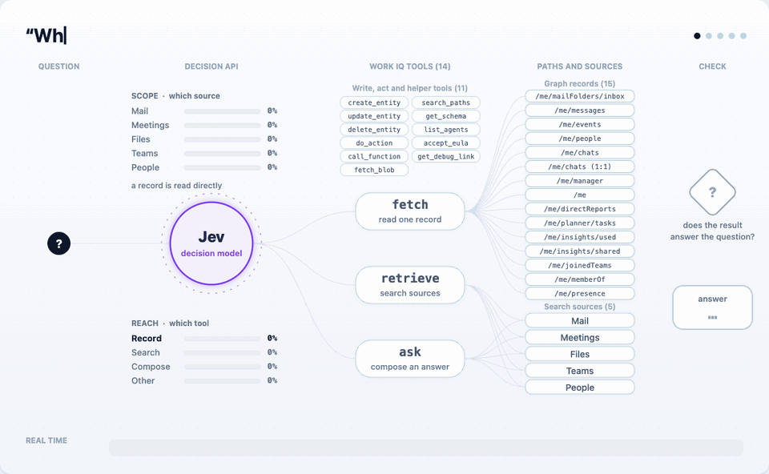
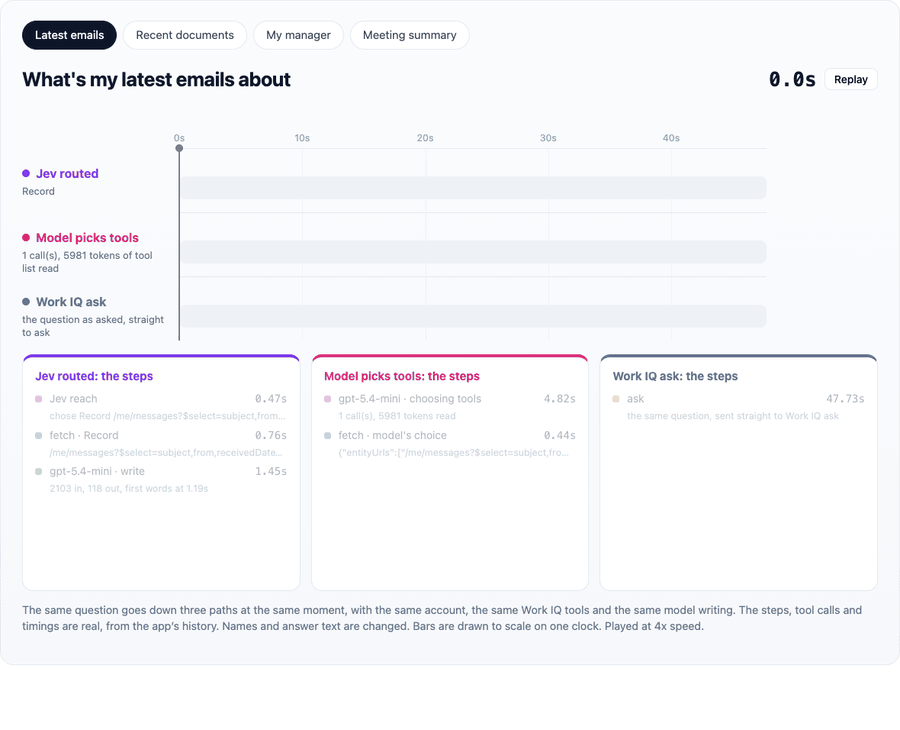

# Work IQ, out loud

Talk to a realtime model, or type to a text model. Both hold two tools:

- `ask_workplace` takes the question as asked. A router (Jev) decides how far
  to reach into Work IQ before any time is spent.
- `search_web` takes a query the model writes and searches the public web
  through Microsoft Web IQ. Optional.

A question goes to Jev, which decides how far to reach, which record or
sources to read, and whether the result holds the answer.
[Open the interactive version](https://hieunhums.github.io/workiq-decision-api/visuals/decision-flow.html).

## Quick start

Text only is the shortest path: no microphone, no realtime deployment.

You need:

| | What | Where it goes |
| --- | --- | --- |
| Jev | A TypeSafe API key | `TYPESAFE_API_KEY` |
| A chat model | An Azure AI Foundry resource with a chat deployment, and the `Cognitive Services OpenAI User` role on it for whoever runs the app | `FOUNDRY_HOST`, `CHAT_DEPLOYMENT` |
| Work IQ | The Work IQ CLI signed in on this machine, or an Entra app registration so people sign in on the page (see [Auth](#auth)) | `WORKIQ_PATH`, or `ENTRA_CLIENT_ID` and `ENTRA_CLIENT_SECRET` |
| A Microsoft 365 account | Mail, calendar and the rest to read. Ask mode and the composing lane also need a Microsoft 365 Copilot licence | |

Then:

    npm install -g @microsoft/workiq
    workiq accept-eula
    workiq auth login                # signs the CLI in to Microsoft 365
    az login                         # the app reaches Foundry as you

    npm install
    cp .env.example .env.local       # fill in the Required block
    npm run dev                      # http://localhost:3000

Set `WORKIQ_PATH` to the output of `which workiq`. Leave `REALTIME_DEPLOYMENT`
empty and the app is text only.

To add voice, deploy `gpt-realtime-2.1` on the same Foundry resource and set
`REALTIME_DEPLOYMENT`. A **Voice / Text** toggle then appears in the top bar,
and the choice is remembered. Text hides Talk and the voice picker; typed
questions are answered by the chat model either way. To add the public web,
set `WEBIQ_API_KEY`.

`npm run e2e` drives a browser with a fake microphone through a real call.
Running `npm run build` while `npm run dev` is live corrupts `.next`; delete it
and restart.

## Why there is a router

Measured on real questions against real data:

| Lane | What it does | Time |
| --- | --- | --- |
| record | One Graph read of a known path | 0.8 to 1.5s |
| search | Retrieval scoped to the sources the question names | about 10s |
| reasoned | The composing Copilot answer | about 52s |

"Who is my manager?" has an exact answer at a known address. Composing it costs
fifty seconds to produce a sentence one read already holds. Jev picks the lane
in about 0.4s. The voice model never sees that choice.

### A plan is many small questions

A plan is one Jev request holding several small questions, combined in code:

- two choices: how far to reach, and which record to read
- one yes or no per source (people, meetings, files, mail, Teams): does the
  question name it. Every named source is searched in one call
- one yes or no: does it name one particular thing. A record such as the
  calendar then becomes a search of that source, since the record holds only
  the latest few

A second request asks how many separate requests the question makes, where
each starts and ends, and whether a later one refers back to an earlier one.
Independent requests are planned and looked up in parallel.

After a fast read, Jev is asked whether the result holds what was asked. A
doubted result goes to the composing reach, unless a lane was chosen by hand.
A search result is checked together with what that source's search holds,
because meeting search returns titles and short excerpts, never the
conversation. This is the only place retrieved content reaches Jev, and all it
can do is escalate.

### The fallback is not confidence based

Over 102 questions, correct routings scored as low as 0.10 and wrong ones as
high as 0.93. No threshold separates them. So the ladder triggers on an empty
result, which is a fact, not an estimate:

1. Read one record, or search the named sources.
2. If a narrowed search found nothing, search everywhere.
3. If something came back, ask Jev whether it answers the question.
4. Report emptiness plainly and let the model decide whether to ask again.

Confidence is still shown in the UI. It is never used to decide.

### Comparing against the other ways

The **Work IQ** picker sets how `ask_workplace` is answered:

| Mode | What it is |
| --- | --- |
| Jev | This app. Jev picks record, search or composed before anything is fetched |
| LLM choice | `gpt-5.4-mini` holding Work IQ's read tools, choosing its own calls |
| Ask | The question sent straight to Work IQ `ask` |

"Who is my manager?" measured from the page: Jev 1.3s warm, LLM choice 3.5s
(3.0s of it deciding), Ask 24.7s. In Jev mode, **Compare** (or **Compare
every question**) runs the other two after the answer, so comparing never
delays it, and shows their answers next to their times.

Across 13 questions, each sent all three ways at the same moment, the Jev
path answered first on 12. Median times: Jev 5.6s, LLM choice 9.3s, Work IQ
ask 22.3s, which composes a fuller answer.
[Open the interactive version](https://hieunhums.github.io/workiq-decision-api/visuals/race.html).

The **Auto / Record / Search / Reasoned** picker forces how far a Jev lookup
reaches. Jev still picks the record or source. The model is never told the
picker exists.

### The corpus is the suggestions

The empty screen offers six questions, and "Browse all 21 topics" opens the
full 102. That is the same list routing is measured against:

    npm run route-check
    npm run route-check -- Manager "Search mail"

It routes only: 102 Jev calls, no Work IQ calls.

## The page

Each question is one card, newest first: the question, a receipt (lane colour,
what was read, time), the answer, then the records behind it. Green is a record
read, blue a scoped search, orange a composed answer.

Each card draws its lookup as a chain that fills in live: tool, reach, record
or source, then the Work IQ call. That needs Jev's plan before the answer, so
`/api/workplace` streams NDJSON: `{type: "plan"}` after about 0.4s, then
`{type: "done"}`. Nothing is staged.

Clicking a receipt opens the details: every step on one time axis, the
comparison, and Jev's probabilities. "How it chooses" opens every option at
every step, with the exact words each chooser reads, built by `/api/choices`
from the same objects sent to the models.

A spoken question's card is placed when the speech is committed, not when its
transcript lands, so the answer never appears above the question. Each response
and lookup is filed under the question that caused it.

## The realtime model

`gpt-realtime-2.1` on Foundry. The older `gpt-realtime` reaches first audio
faster (about 0.5s against 0.9 to 1.2s), but it stays silent until the tool
returns. 2.1 says "let me check" at about 950ms and then waits.

`src/lib/agent.ts` tells the model to pass the question word for word. Left
alone, 2.1 rewrote "What did Diego say about Northwind last week?" into a forty
word instruction, which breaks a router that reads the question's wording.

Two protocol details:

- **webrtcfilter stays off.** It drops every function call event.
- **One response at a time.** Between sending `response.create` and receiving
  `response.created` there is a gap of a few hundred milliseconds, and a
  boolean "busy" flag gets it wrong either way. The client tracks `free`,
  `asked` and `running`, queues a request made while not free, and defers a
  cancel made during `asked`.

Every tool result starts with the date and time in `USER_TIME_ZONE`, because
the model has no clock and a call can run past midnight.

## Typing instead of talking

With no call open, or with the Text toggle on, typed questions go to
`CHAT_DEPLOYMENT` through `/api/chat` with the same tools and instructions
(`mode: "text"`). The page runs each tool
through the same `/api/workplace` and `/api/web`, so cards and replays are
identical. Typed questions are answered one at a time, because a question sent
between the model's tool call and its result is rejected.

## The public web

`search_web` calls Web IQ `sonic` over MCP (`https://api.microsoft.ai/v3/mcp`,
header `x-apikey`), measured at 0.17 to 0.3s. Passages are capped at 400
characters and five pages. With `show: "images" | "videos"` the matching Web
IQ tool runs alongside, and a failure there never fails the search. Only Bing
hosted previews are loaded, and adult results are dropped.

Web and Work IQ text are untrusted: shown or spoken, never followed.

## Transports

- **`cli.ts`**: MCP over stdio to a signed-in `workiq` binary. Used when
  `WORKIQ_PATH` is set. The page starts it on connect, since it takes about
  four seconds.
- **`service.ts`**: for a person signed in on the page. Record reads and
  searches go to Microsoft Graph with their delegated token. Composed answers
  go to the Work IQ A2A gateway (`https://workiq.svc.cloud.microsoft/a2a/`,
  header `A2A-Version: 1.0`).

The CLI cannot sign in inside a container (MSAL needs the Windows WAM broker),
so a container uses the service transport only.

## Auth

| What | How |
| --- | --- |
| Jev | `TYPESAFE_API_KEY` |
| Foundry realtime | Entra: `az login` locally, managed identity in a container |
| Work IQ | The person signed in on the page, or the CLI on this machine |

The realtime token scope is `https://ai.azure.com/.default`, not
`cognitiveservices.azure.com`. The wrong one returns a 401 with no reason.

Sign-in is auth code with PKCE on the server (`@azure/msal-node`). The browser
holds only a session id cookie. Tokens are cached in the server process, so
more than one replica needs sticky sessions. The app registration needs:

- Platform **Web**, redirect URI `<origin>/api/auth/callback`, a client secret.
- Delegated Graph permissions: `User.Read`, `User.Read.All`, `People.Read`,
  `Mail.Read`, `Calendars.Read`, `Chat.Read`, `Presence.Read`, `Tasks.Read`,
  `Files.Read.All`, `Sites.Read.All`, `Team.ReadBasic.All`,
  `GroupMember.Read.All`.
- Delegated Work IQ permission `WorkIQAgent.Ask` (app id
  `fdcc1f02-fc51-4226-8753-f668596af7f7`).

For a signed-in person, LLM choice mode is not available (it lists MCP tools,
which only the CLI can). Ask mode and the reasoned lane need a Microsoft 365
Copilot licence.

## Deploying

    TYPESAFE_API_KEY=... WEBIQ_API_KEY=... \
    FOUNDRY_HOST=... ENTRA_CLIENT_ID=... ENTRA_CLIENT_SECRET=... ./scripts/deploy.sh

Builds in ACR for amd64 and deploys to Azure Container Apps with a system
assigned identity and `min-replicas 1`, since a cold start in front of a
conversation defeats the point. It prints the two grants a deployer may not be
able to make: a Foundry role for the identity, and the redirect URI on the
sign-in registration.

## Layout

    src/lib/jev.ts              Jev client: several questions, one request
    src/lib/router.ts           lanes, record paths, cutting, the result check
    src/lib/prompts.json        what each option means, in words
    src/lib/questions.json      the 102 question corpus
    src/lib/agent.ts            model instructions and the two tools
    src/lib/webiq.ts            Web IQ call
    src/lib/workiq/             the fallback ladder, transports, reply reader
    src/lib/useRealtime.ts      WebRTC, tool dispatch, text mode, meters
    src/app/ui/                 cards, details, path, replay, suggestions
    src/app/api/                session, workplace, web, chat, choices, auth
    docs/visuals/               README animations and their interactive pages

There is no keyword list and no regex in the routing. Adding a lane means
describing what it means in `prompts.json`.

## Known gaps

- The A2A gateway `ask` has not been run for a licensed signed-in user.
- The reasoned lane takes about 52 seconds, and nothing fills that silence yet.
